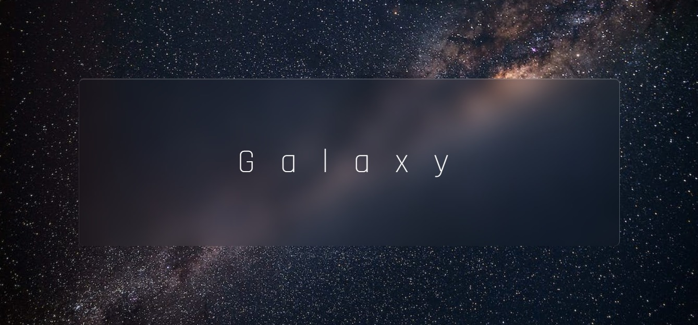

# Efeito de Vidro

Este projeto se trata de uma página web que expõe um modelo de refrator de vidro feito com HTML5 e CSS3. O refrator de vidro em si não é funcional, mas sim uma demonstração de habilidades de design e desenvolvimento web.

## Preview

## Tecnologias Utilizadas

Este projeto foi desenvolvido com as seguintes tecnologias:

*   HTML5
*   CSS3

## Como Utilizar

Na página, você pode visualizar o modelo de refrator de vidro e suas características visuais. Além disso, você pode visualizar o código fonte do projeto no arquivo `index.html` e no arquivo `style.css`.

## Contribuindo

Este projeto foi desenvolvido como uma demonstração e não está aberto para contribuições externas.

## Licença

Este projeto está licenciado sob a Licença MIT - veja o arquivo `LICENSE` para mais detalhes.
